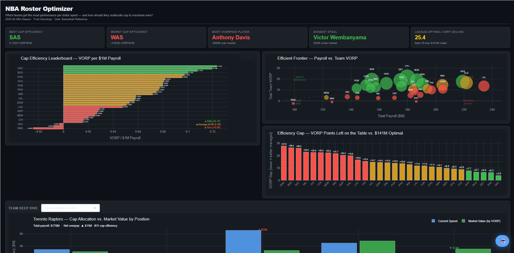
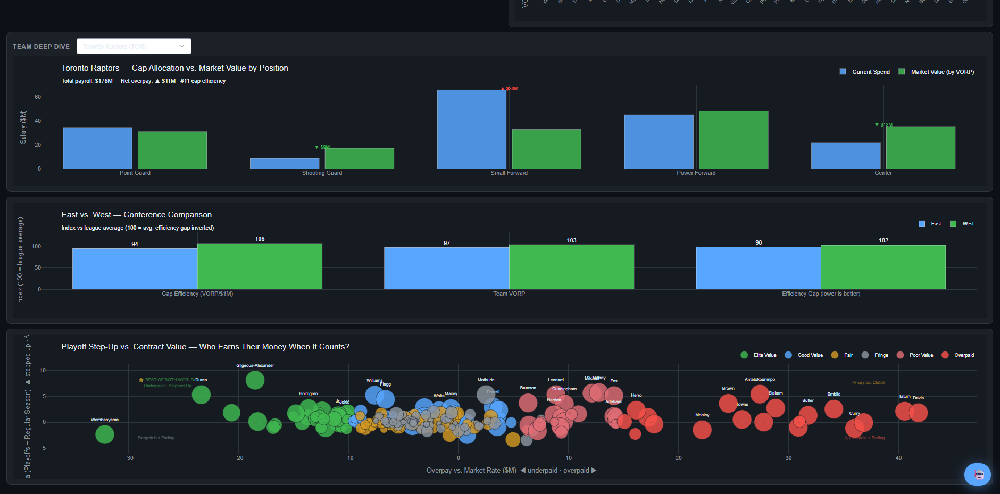
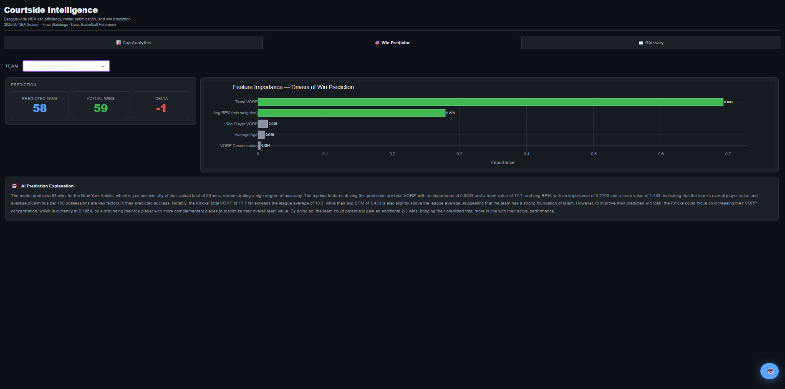
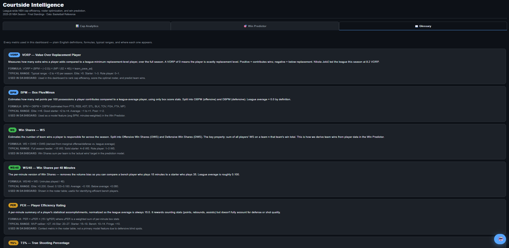

# Courtside Intelligence — NBA Cap Value Optimizer

An end-to-end NBA roster efficiency analytics system that turns raw player stats and contract values into a decision-grade dashboard for front-office style resource allocation. The project spans data ingestion, feature engineering, roster optimization, win prediction, and an interactive Dash app with an embedded AI analyst.

## What This Delivers
- **League-wide cap efficiency benchmarking** (VORP per $1M) across all 30 teams.
- **Efficient frontier analysis** to surface smart spenders vs. inefficient payrolls.
- **Optimization gap diagnostics** comparing current vs. theoretical roster efficiency.
- **Team deep dive** with position-level salary allocation vs. market value.
- **Playoff step-up analytics** connecting contract value to postseason performance.
- **East vs. West comparative analytics** indexed against league averages.
- **Win prediction model** with $R^2$ accuracy scored against historical team data.
- **Feature importance visualization** showing which roster factors drive win totals.
- **AI-powered prediction explanation** that contextualizes each team's forecast in plain English.
- **Interactive Dash application** designed for portfolio-grade storytelling.

## Dashboard Highlights
- Cap Efficiency Leaderboard
- Efficient Frontier (Payroll vs. VORP)
- Efficiency Gap Ranking
- Team Deep Dive (all 30 teams)
- East vs. West Conference Comparison
- Playoff Step-Up vs. Contract Value
- **Win Predictor** — per-team ML win forecast with feature importance chart and AI explanation
- Embedded AI Analyst for guided interpretation

## Dashboard Preview

### Cap Efficiency & Efficient Frontier


### Team Deep Dive & Conference Analytics


### Win Predictor


### Glossary


## Data Pipeline
1. **Raw stats ingestion** from Basketball Reference exports (Kaggle CSVs).
2. **Salary data integration** and normalization.
3. **Master dataset build** combining performance and pay.
4. **Value metric computation** using VORP-based market value modeling.
5. **Team-level aggregation** for efficiency and gap analysis.
6. **Playoff step-up simulation** for postseason visualization.
7. **Win model training** (optional) using historical team data.

## Repository Structure
- `run_pipeline.py` — one-command pipeline runner (fetch, train, launch dashboard)
- `build_master.py` — merges raw stats and salary data into `master.csv`
- `value_metric.py` — computes player value and overpay metrics
- `optimizer.py` — team efficiency modeling inputs (cap efficiency + gaps)
- `build_playoffs.py` — generates playoff vs. regular-season deltas (simulated)
- `fetch_historical.py` — builds `historical_teams.csv` from local stats dataset
- `build_training_data.py` — merges historical + current season into `training_data.csv`
- `win_predictor.py` — trains and evaluates win prediction models; saves `win_model.pkl`
- `dashboard.py` — Dash app and visual analytics (Cap Analytics + Win Predictor tabs)
- `agent.py` — AI analyst helper (chat + win prediction explanation)
- `*.csv` — curated data outputs used by the dashboard

## Quick Start
```bash
# 1) Create and activate a virtual environment (Windows)
python -m venv venv
venv\Scripts\activate

# 2) Install dependencies
pip install pandas numpy dash plotly requests beautifulsoup4 lxml scikit-learn joblib python-dotenv groq

# 3) Set environment variables (for the AI analyst)
# Create a .env file with:
# GROQ_API_KEY=your_api_key_here

# 4) Run the full pipeline (recommended)
python run_pipeline.py

# Or skip expensive steps
python run_pipeline.py --skip-fetch --skip-training

# Or launch dashboard only
python run_pipeline.py --dashboard-only

# Or run individual steps
python build_master.py
python value_metric.py
python optimizer.py
python build_playoffs.py

# 5) Run the dashboard (if not using run_pipeline)
python dashboard.py
```
Open http://127.0.0.1:8050

The Win Predictor tab is fully functional after step 3. If you skip step 3, the
Cap Analytics tab still works normally and the Win Predictor tab shows setup instructions.

## Win Prediction Model

### What it does
The win prediction model learns from historical NBA team data to predict how many
regular-season games a team will win based on roster-level features: team VORP,
top-player VORP, VORP concentration (how dependent the team is on its best player),
average roster age, average BPM, and cap efficiency. Given any team's current-season
feature values (derived live from `master.csv`), the model outputs a predicted win total.

### Model performance

| Model | R² (CV) | MAE (CV) |
|---|---|---|
| Linear Regression | 0.9817 | 1.29 |
| Random Forest | 0.9773 | 1.40 |
| Gradient Boosting | 0.9763 | 1.42 |

**Best model**: Linear Regression  ·  **R²**: 0.9817  ·  **MAE**: 1.29 wins

### Top feature importances

1. `total_vorp` — total team VORP is the strongest predictor of wins
2. `avg_bpm` — team-wide efficiency carries strong signal
3. `top_player_vorp` — a dominant star drives disproportionate win value

### Example prediction
OKC: model predicts 64.5 wins, actual 63, delta +1.5

## Key Metrics
- **VORP**: Value Over Replacement Player
- **Cap Efficiency**: VORP per $1M payroll
- **Efficiency Gap**: delta between current and league-optimal roster VORP
- **Overpay**: salary minus modeled market value

## Data Inputs
- `Player Per Game.csv` + `Advanced.csv` — 2025-26 player stats exports
- `salaries.csv` — 2025-26 contract values with player IDs
- `stats_since_1950/Seasons_Stats.csv` — historical team data used for win model

## Outputs
- `master.csv` — merged player stats + salary
- `value_metrics.csv` — per-player value tiers and overpay
- `team_efficiency.csv` — per-team cap efficiency + gaps
- `playoffs.csv` — playoff vs regular-season efficiency deltas
- `training_data.csv` — historical + current season features for ML
- `win_model.pkl`, `feature_importance.csv`, `model_meta.json`

## Notes
- Data is aligned to the 2025-26 NBA season.
- Playoff data is simulated unless you replace it with real playoff stats.
- The dashboard is designed for desktop viewing and one-page executive summary layouts.

## License
MIT
